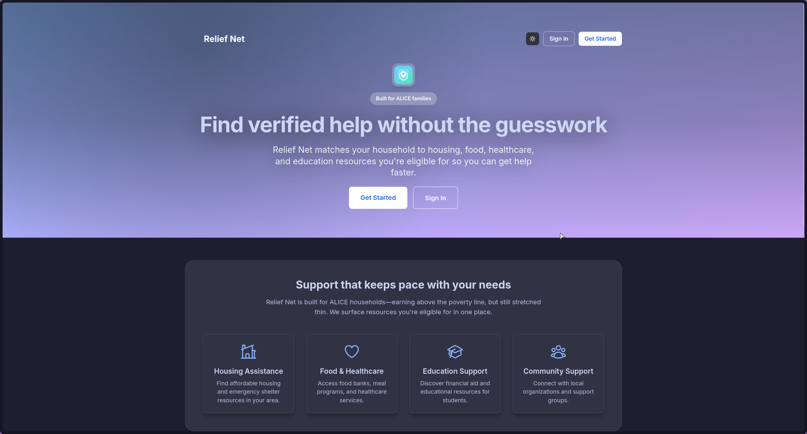

# Relief Net - Resource Assistance Platform

A web application that helps low-income families (ALICE population) find and access community resources they're eligible for through automated eligibility matching.

**Team Sink** - Software Engineering Project CTW

## Team Members

- Diana Avila
- Sangit Gaire
- Kobe Leverett
- Puru Sahuja

## Overview

Relief Net addresses the challenge faced by families earning just above the poverty line who struggle to find resources they qualify for. The application uses demographic profiling to automatically filter and display only eligible community resources.

## Product Preview



### Core Features

- Eligibility-based resource filtering (income, household size, location, student/disability status)
- User profile management with persistent demographic data
- Resource search and filtering by type (food, housing, healthcare, education, nonprofit aid)
- Bookmark system for saving resources
- Admin panel for resource management
- Partner portal for community organizations
- Notification system for new resources
- Offline support via Firebase caching
- Mobile-responsive design with Catppuccin Latte theme
- **WCAG 2.1 AA accessibility compliance** with full screen reader and keyboard navigation support

## Technology Stack

**Frontend:** React (Vite), Tailwind CSS, React Router, Axios, Firebase Auth
**Backend:** Node.js, Express.js, Firebase Admin SDK
**Database:** Firebase Firestore (NoSQL)
**Package Manager:** pnpm

## Project Structure

```
Team-Sink/
├── client/                 # React frontend (Vite + Tailwind, port 5173)
│   ├── src/
│   │   ├── components/     # Layout shell, skip link, theme toggle
│   │   ├── pages/          # Route views + Vitest page tests
│   │   ├── context/        # Auth and theme providers
│   │   ├── services/       # API service layer (Axios)
│   │   ├── config/         # Firebase client configuration
│   │   ├── test/           # Vitest setup, mocks, sample data, utils
│   │   ├── App.jsx         # App shell
│   │   ├── main.jsx / main.ts # Entrypoints (JS/TS)
│   │   └── index.css / style.css
│   ├── public/             # Static assets
│   ├── .env.example        # Frontend environment template
│   ├── TESTING.md          # Frontend testing guide
│   └── vite.config.js / tailwind.config.js / vitest.config.js
│
├── server/                # Express backend (port 5000)
│   ├── config/firebase.js # Firebase Admin configuration
│   ├── middleware/auth.js # Authentication middleware
│   ├── routes/            # API endpoints (auth, profile, resources, bookmarks, partners, notifications)
│   ├── seed-resources.js  # Firestore seeding script (run from server/)
│   ├── index.js           # Backend entrypoint
│   └── .env.example       # Backend environment template
│
├── scripts/               # Setup helper scripts
│   └── get-firebase-config.sh # Interactive Firebase config
│
├── firebase/              # Firebase configuration files
│   ├── firebase.json      # Hosting and Firestore config
│   ├── firestore.rules    # Security rules
│   └── firestore.indexes.json # Database indexes
│
├── docs/                  # Project artifacts
│   ├── Project Plan.pdf
│   └── Relief Net.pptx
│
└── README.md
```

## Setup Instructions

### Prerequisites

- Node.js v18+
- pnpm v8+
- Firebase CLI (`pnpm add -g firebase-tools`)
- Git

### 1. Clone Repository

```bash
git clone <repository-url>
cd Team-Sink
```

### 2. Install Dependencies

```bash
# Backend
cd server && pnpm install

# Frontend
cd client && pnpm install
```

### 3. Firebase Configuration

The Firebase project (`reliefnet-app`) is already created with Firestore and security rules deployed.

#### Option A: Interactive Setup (Recommended)

Run the setup script for step-by-step guidance:

```bash
./scripts/get-firebase-config.sh
```

This script will guide you through:
- Enabling Email/Password authentication
- Obtaining web app credentials for frontend
- Obtaining service account credentials for backend
- Creating environment files

#### Option B: Manual Setup

**Frontend Environment** (`client/.env`):

```bash
cp client/.env.example client/.env
```

Visit [Firebase Console - Project Settings](https://console.firebase.google.com/project/reliefnet-app/settings/general), register a web app, and add the credentials:

```
VITE_FIREBASE_API_KEY=<from Firebase Console>
VITE_FIREBASE_AUTH_DOMAIN=reliefnet-app.firebaseapp.com
VITE_FIREBASE_PROJECT_ID=reliefnet-app
VITE_FIREBASE_STORAGE_BUCKET=reliefnet-app.firebasestorage.app
VITE_FIREBASE_MESSAGING_SENDER_ID=<from Firebase Console>
VITE_FIREBASE_APP_ID=<from Firebase Console>
VITE_API_URL=http://localhost:5000
```

**Backend Environment** (`server/.env`):

```bash
cp server/.env.example server/.env
```

Visit [Firebase Console - Service Accounts](https://console.firebase.google.com/project/reliefnet-app/settings/serviceaccounts/adminsdk), generate a private key, and add the credentials:

```
PORT=5000
NODE_ENV=development
FIREBASE_PROJECT_ID=reliefnet-app
FIREBASE_PRIVATE_KEY="<paste entire private_key from JSON, keep \n characters>"
FIREBASE_CLIENT_EMAIL=<client_email from JSON>
```

**Important:** The private key must be in quotes with literal `\n` characters (not actual newlines).

**Enable Authentication:**

Visit [Firebase Console - Authentication](https://console.firebase.google.com/project/reliefnet-app/authentication/providers) and enable the Email/Password provider.

### 4. Run Application

Start both servers in separate terminals:

```bash
# Terminal 1 - Backend
cd server && pnpm dev

# Terminal 2 - Frontend
cd client && pnpm dev
```

Access the application at http://localhost:5173

### Run with Docker (Frontend + Backend)

Prerequisites: Docker + Docker Compose.

1. Build and start both services:
   ```bash
   docker compose up --build
   ```
   - Client: http://localhost:4173
   - API: http://localhost:5000

2. To stop containers:
   ```bash
   docker compose down
   ```
Re-run with `--build` whenever you change environment variables so the frontend picks up new values. Leave `VITE_API_URL` at the default `http://localhost:5000` (or update the port mapping if you change it).

## API Endpoints

All endpoints are prefixed with `/api`.

### Authentication
- `POST /api/auth/register` - Register user and set custom claims
- `POST /api/auth/verify` - Verify authentication token

### User Profile (Protected)
- `GET /api/profile` - Retrieve user profile
- `POST /api/profile` - Create/update profile
- `DELETE /api/profile` - Delete profile

### Resources (Protected)
- `GET /api/resources` - List eligible resources (filtered by user profile)
- `GET /api/resources/:id` - Get resource details
- `POST /api/resources` - Create resource (admin only)
- `PUT /api/resources/:id` - Update resource (admin only)
- `DELETE /api/resources/:id` - Delete resource (admin only)

### Bookmarks (Protected)
- `GET /api/bookmarks` - List user bookmarks
- `POST /api/bookmarks` - Add bookmark
- `DELETE /api/bookmarks/:id` - Remove bookmark

### Partners (Protected)
- `GET /api/partners` - List partners
- `GET /api/partners/:id` - Get partner details
- `POST /api/partners` - Register organization
- `PUT /api/partners/:id` - Update organization
- `POST /api/partners/:id/verify` - Verify partner (admin only)
- `DELETE /api/partners/:id` - Delete partner (admin only)

### Notifications (Protected)
- `GET /api/notifications` - List user notifications
- `POST /api/notifications` - Create notification (admin only)
- `PUT /api/notifications/:id/read` - Mark as read
- `PUT /api/notifications/read-all` - Mark all as read
- `DELETE /api/notifications/:id` - Delete notification

## Database Schema

### Firestore Collections

**users**
```javascript
{
  uid: string,
  location: string,
  zipCode: string,
  hasTransportation: boolean,
  hasDisability: boolean,
  incomeRange: string,              // "0-15000", "15000-25000", etc.
  householdSize: number,
  isStudent: boolean,
  updatedAt: timestamp
}
```

**resources**
```javascript
{
  name: string,
  description: string,
  type: string,                      // food, housing, healthcare, education, nonprofit_aid
  location: string,
  contact: string,
  eligibilityCriteria: {
    maxIncome: number,
    minHouseholdSize: number,
    maxHouseholdSize: number,
    requiresStudent: boolean,
    requiresDisability: boolean,
    zipCodes: array
  },
  website: string,
  hours: string,
  createdAt: timestamp,
  updatedAt: timestamp
}
```

**bookmarks**
```javascript
{
  userId: string,
  resourceId: string,
  createdAt: timestamp
}
```

**partners**
```javascript
{
  userId: string,
  organizationName: string,
  contactName: string,
  email: string,
  phone: string,
  address: string,
  description: string,
  services: array,
  verified: boolean,
  createdAt: timestamp,
  updatedAt: timestamp
}
```

**notifications**
```javascript
{
  userId: string,
  title: string,
  message: string,
  type: string,
  resourceId: string,
  read: boolean,
  createdAt: timestamp
}
```

## Firebase Deployment

Security rules and indexes are already deployed. To redeploy or update:

```bash
# Deploy Firestore rules and indexes
firebase deploy --only firestore

# Build and deploy frontend hosting
cd client && pnpm build
firebase deploy --only hosting
```

## Development Notes

### Eligibility Matching

The eligibility algorithm in `server/routes/resources.js` filters resources based on:
1. Income threshold comparison
2. Household size range
3. Special status flags (student, disability)
4. Geographic ZIP code matching

Resources without eligibility criteria are shown to all users.

### Authentication Flow

1. User registers/logs in via Firebase Auth
2. Client calls `/api/auth/register` to set custom claims (admin/user roles)
3. Client automatically includes JWT token in all API requests via Axios interceptor
4. Server validates token with Firebase Admin SDK using `verifyToken` middleware
5. Admin endpoints require both `verifyToken` and `verifyAdmin` middleware

### Environment Variables

- Frontend variables must be prefixed with `VITE_` to be exposed to client code
- Backend private key must include literal `\n` characters in the `.env` file
- Never commit `.env` files to version control

## Accessibility

Relief Net is built with **WCAG 2.1 AA compliance** to ensure the platform is usable by everyone, including users with disabilities. This is especially important for the ALICE population we serve.

### Implemented Features

✅ **Keyboard Navigation**
- Full keyboard support (Tab, Shift+Tab, Enter, Space, Escape)
- Skip navigation link to bypass repetitive content
- Visible focus indicators on all interactive elements

✅ **Screen Reader Support**
- Semantic HTML5 landmarks (nav, main, header, footer)
- ARIA labels and roles throughout the application
- Live region announcements for dynamic content (loading states, errors, search results)
- Descriptive button and link labels

✅ **Form Accessibility**
- Proper label associations for all inputs
- Required field indicators (`aria-required`)
- Error messages with `role="alert"` for immediate announcement
- Loading states with `aria-busy`
- Field hints linked via `aria-describedby`

✅ **Content Structure**
- Proper heading hierarchy (h1 → h2 → h3)
- Semantic HTML elements (article, section, nav)
- Decorative icons marked with `aria-hidden="true"`
- Screen reader-only context where needed

### Testing Accessibility

**Automated Testing:**
```bash
# Run Lighthouse accessibility audit
npx lighthouse http://localhost:5173 --only-categories=accessibility
```

**Manual Testing:**
- **Keyboard:** Navigate the entire app using only keyboard
- **Screen Readers:** Test with NVDA (Windows), JAWS (Windows), or VoiceOver (macOS)
- **Zoom:** Test at 200% browser zoom
- **Color Contrast:** All text meets WCAG AA contrast ratios (4.5:1 for normal text)

## Testing

### Automated

- **Client unit/integration (Vitest + React Testing Library, jsdom):**
  ```bash
  cd client
  pnpm test           # or: npx vitest run --pool=threads
  ```
  Tests cover auth flows (Register), profile form, resources list/detail, and bookmarks UI. A non-fatal React `act()` warning currently appears during the Resources loading test.
- **Server:** no automated test suite yet.

### Manual test data setup

- Add resources in Firestore for eligibility/search flows:
  1. Go to [Firestore Console](https://console.firebase.google.com/project/reliefnet-app/firestore/data)
  2. Create collection `resources`
  3. Add documents with required fields (`name`, `description`, `type`, `location`, `eligibilityCriteria`, etc.)

- Create admin users:
  1. Register via the app
  2. Copy UID from [Firebase Authentication](https://console.firebase.google.com/project/reliefnet-app/authentication/users)
  3. Set custom claims with Firebase Admin SDK/CLI: `{ admin: true, role: 'admin' }`

## Roadmap / TODO

See `TODO.md` for the current backlog and planned enhancements.
